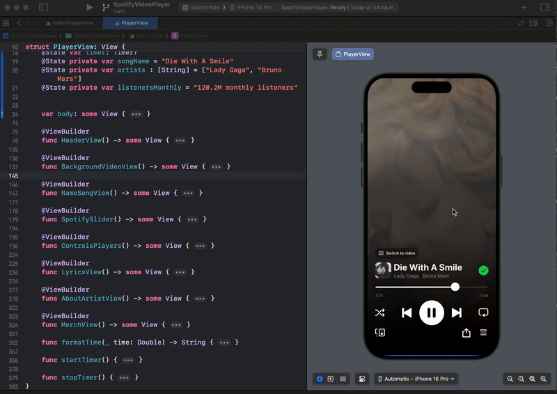

<div align="center">
  
  <h1><b>SpotifyVideoPlayer</b></h1>
  <p>SpotifyVideoPlayer is a SwiftUI-based music player that replicates the Spotify video playback experience, featuring smooth transitions, interactive controls, and a visually engaging UI. The app integrates a background video player, song lyrics display, artist details, and a merchandise section, providing a rich and immersive music streaming experience.<br>
</div>

## ✨ Features
- **Background Video Playback**: Enjoy a dynamic video background while listening to your favorite tracks.
- **Interactive Music Controls**: Play, pause, shuffle, repeat, and navigate through tracks with an intuitive UI.
- **Lyrics Display**: Sing along with synchronized lyrics in an elegant, easy-to-read format.
- **Artist Information**: View artist details, including monthly listeners and biography.
- **Merch Store**: Explore and purchase artist merchandise directly from the player.
- **Customizable Slider**: Track progress with a sleek, responsive music progress slider.
  
## 🚀 Technologies Used
- **SwiftUI** for a declarative and modern UI.
- **AVKit** for seamless video playback.
- **Timers & State Management** for handling playback progress.
- **GeometryReader & ScrollView** for dynamic UI scaling and animations.

## 🔥 Installation
1. Clone the repository:
   ```sh
   git clone https://github.com/ronaldo-avalos/SpotifyVideoPlayer.git
